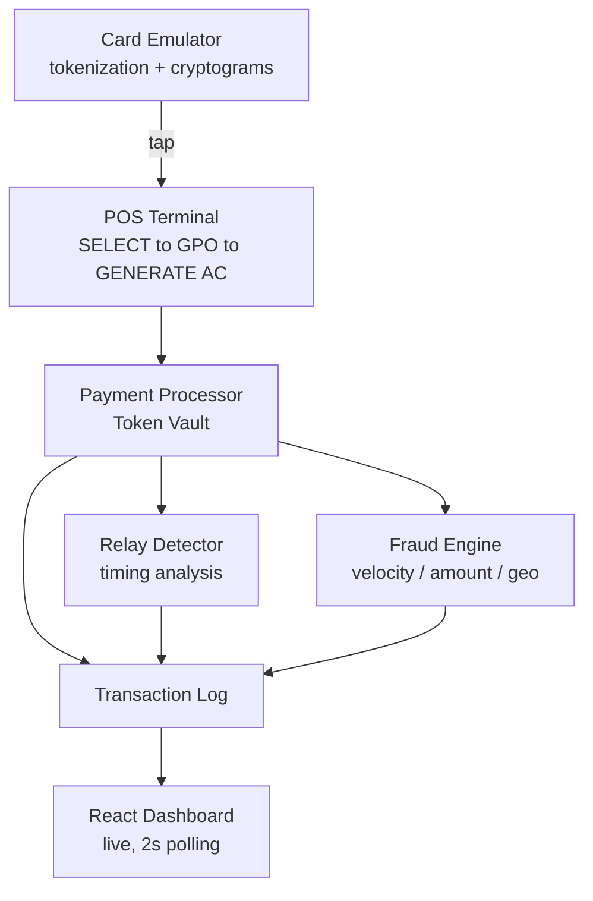

# 💳 NFC Payment Simulator

**A full-stack contactless payment system simulating real EMV security architecture — tokenization, fraud detection, and relay-attack defense — the same mechanisms behind Apple Pay, Google Pay, and Amazon Pay.**


---

## 🎯 Why this exists

Most student "payment app" projects are checkout forms with a database behind them. This project instead simulates the **actual security mechanisms** that make contactless payments trustworthy:

- Real card numbers are never transmitted — only single-use cryptograms
- Every transaction is scored for fraud risk across multiple signals before it's approved
- A genuinely underused attack vector — **NFC relay attacks** — is detected using timing analysis, the same technique real payment security teams use

It's built to demonstrate _systems + security thinking_, not just CRUD.

---

## 🏗️ Architecture



---

## 🔐 What each module actually does

| Module                           | Real-world concept it implements                                                                                                                                                                           |
| -------------------------------- | ---------------------------------------------------------------------------------------------------------------------------------------------------------------------------------------------------------- |
| **`card_emulator.py`**           | Tokenization (HMAC-derived token, real PAN never sent) + per-tap cryptogram generation bound to an Application Transaction Counter — mirrors EMV ARQC generation. A captured cryptogram can't be replayed. |
| **`pos_terminal.py`**            | The real EMV contactless command sequence — `SELECT` → `GET PROCESSING OPTIONS` → `GENERATE AC` — not a generic API call.                                                                                  |
| **`app.py`** (Payment Processor) | Token vault + balance validation, mirroring how Visa Token Service / issuer backends never see the raw card number.                                                                                        |
| **`fraud_detection.py`**         | Multi-signal weighted risk scoring — velocity, amount anomaly, geolocation jump — the same "combine weak signals into one decision" approach used by real fraud engines like Visa Advanced Authorization.  |
| **`relay_detector.py`**          | Timing-based relay-attack detection. Relay attacks intercept and re-transmit NFC signals over a network; genuine local taps complete in milliseconds, relayed ones don't. This module catches that gap.    |
| **`frontend/`**                  | Live React dashboard — transaction feed, fraud scores, relay-check timing, all polling in real time.                                                                                                       |

---

## 🖥️ Tech Stack

**Backend:** Python · Flask · Flask-CORS
**Frontend:** React · Vite
**Security primitives:** HMAC-SHA256 (tokenization & cryptograms) · rule-based anomaly scoring · timing-based attack detection

---

## 🚀 Getting Started

### 1. Backend

```bash
cd backend
python -m venv venv
venv\Scripts\activate        # Windows
# source venv/bin/activate   # macOS/Linux
pip install -r requirements.txt
python app.py
```

### 2. Frontend

```bash
cd frontend
npm install
npm run dev
```

Open **http://localhost:5173**

### 3. Generate live transactions

In a third terminal:

```bash
cd backend
venv\Scripts\activate
python simulate_transaction.py   # normal approve/decline flow
python test_fraud_trigger.py     # triggers a fraud flag (velocity + amount spike)
python test_relay_attack.py      # triggers a relay-attack flag (timing anomaly)
```

Watch the dashboard update live as each scenario runs — no refresh needed.

---

## 🧠 What this project demonstrates

- ✅ Understanding of real EMV/contactless transaction flow — not just "payments in general"
- ✅ Practical, explainable fraud scoring design (multi-signal, weighted, tunable)
- ✅ A rare, real attack vector (NFC relay attacks) with a working detection method
- ✅ End-to-end systems thinking — emulated hardware layer → backend → live dashboard, not an isolated script
- ✅ Debugging a real environment-calibration problem: the relay-attack latency threshold had to be tuned against actual local round-trip baselines to avoid false positives — a genuine security-engineering tradeoff, not just a toy constant

---

## ⚠️ Limitations (by design, for a simulation)

- Not real EMV cryptography (3DES/AES session keys) — HMAC-SHA256 stands in for demonstration purposes
- No real NFC/ISO 14443 hardware communication
- In-memory storage — transaction history resets on backend restart (no database yet)
- Relay-attack threshold is tuned for local dev latency and would need recalibration for production

---

## 📄 License

MIT — free to use, learn from, or extend.
